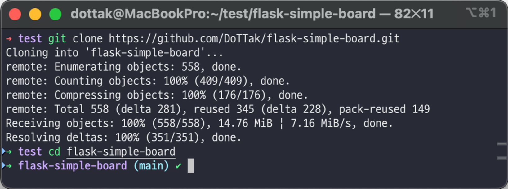
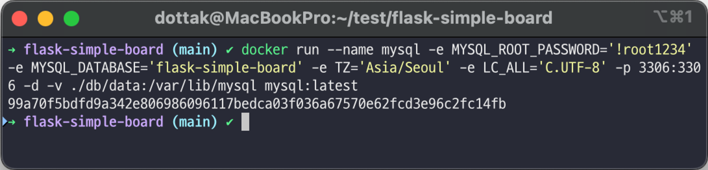
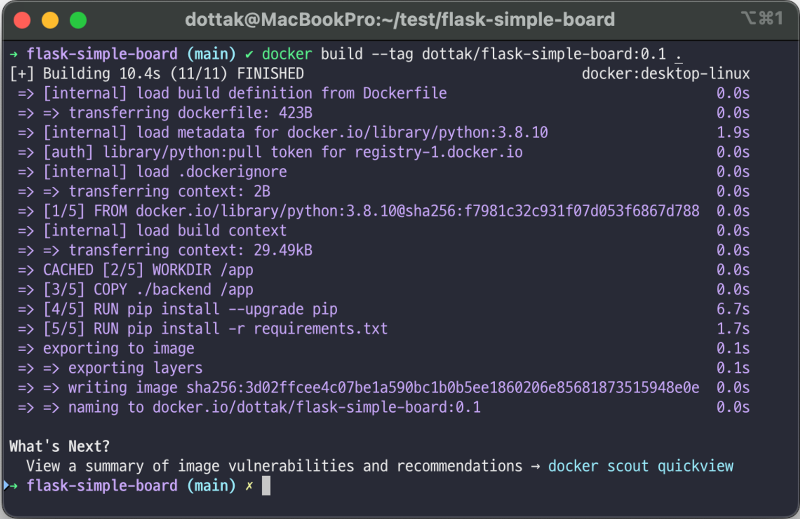
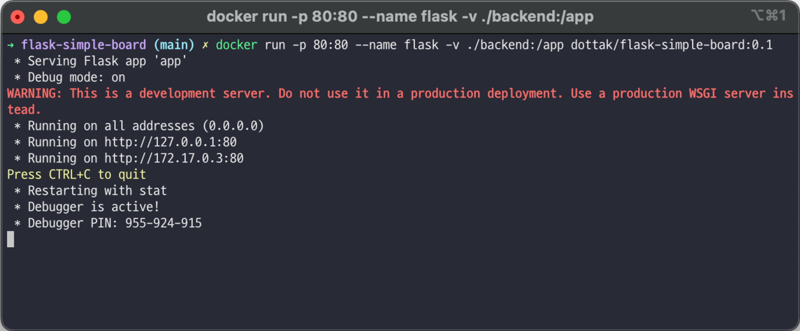
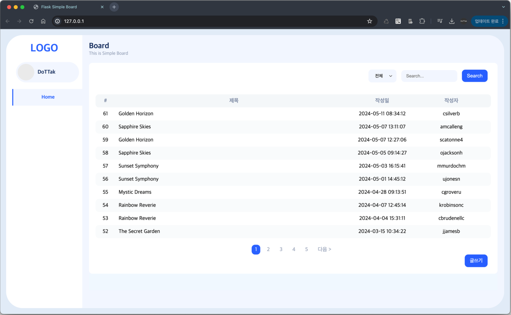
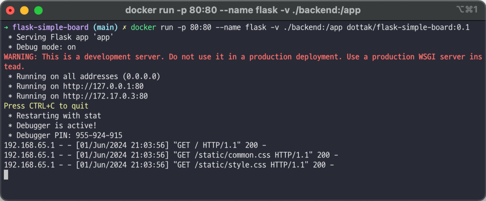

# flask-simple-board

# 프로젝트 실행 방법

https://github.com/DoTTak/flask-simple-board/commits/main/ 커밋 기준으로 `docker` 를 이용해서 `flask-simple-board` 프로젝트를 실행하는 방법에 대한 설명이다.

## 1. git clone

```bash
git clone https://github.com/DoTTak/flask-simple-board.git
cd flask-simple-board
```



## 2. MySQL 설치 및 구동

`/db/data` 경로에 이미 테스트 데이터가 셋팅되어 있다.

```bash
docker run --name mysql -e MYSQL_ROOT_PASSWORD='!root1234' -e MYSQL_DATABASE='flask-simple-board' -e TZ='Asia/Seoul' -e LC_ALL='C.UTF-8' -p 3306:3306 -d -v ./db/data:/var/lib/mysql mysql:latest
```



## 3. flask-sample-board 이미지 빌드

```bash
docker build --tag dottak/flask-simple-board:0.1 .
```



## 4. flask-sample-board 이미지 실행

```bash
docker run -p 80:80 --name flask -v ./backend:/app dottak/flask-simple-board:0.1
```



## 5. 서버 접속

브라우저를 통해 [`http://127.0.0.1`](http://127.0.0.1:80) 으로 접속하면 아래의 웹 페이지와 접속 로그가 출력된다.




